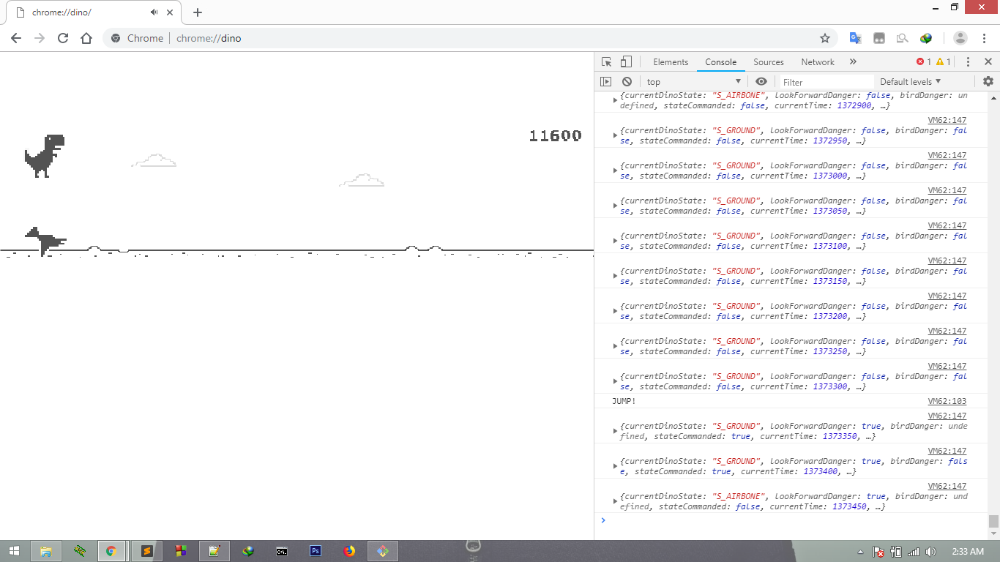
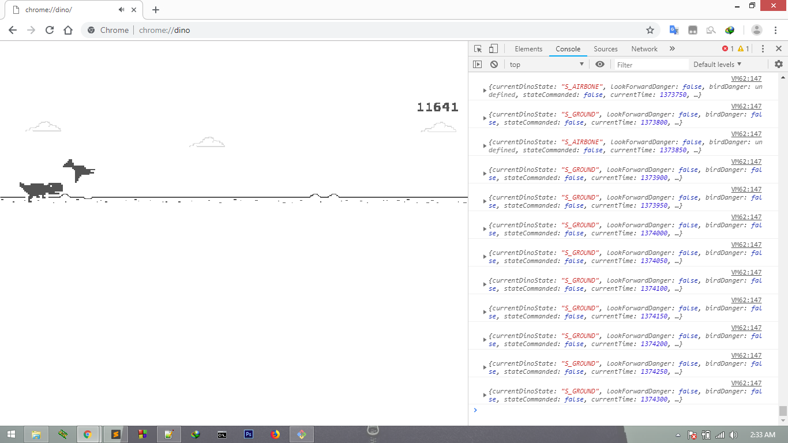

## DinoBot
A simple script to automatically play the chrome offline dinosaur dino.

## Bot Logic
- The logic here is to look ahead of the dinosaur for obstacles when an obstacle is detected jump.
- If the obstacle is a `bird` then `duck`.
- The dinosaur's current state is tracked by the `eye` position.
- The logic is the dinosaur's eye is in a constant defined position in every state (running, duck).
- Using this we can reliably detect the current state the dinosaur is in. 

## Usage
- Open **chrome://dino/** and open developer tools.
- Copy DinoBot script into the console in the browser and hit enter.
- Now start the dino by pressing space bar.
- The dinosaur should now be controlling itself !

## Screenshot

